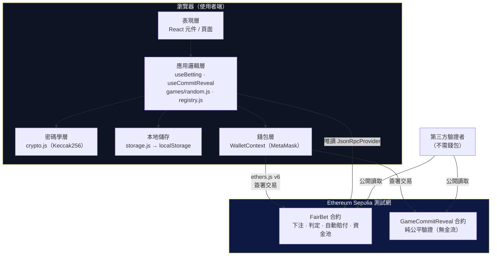
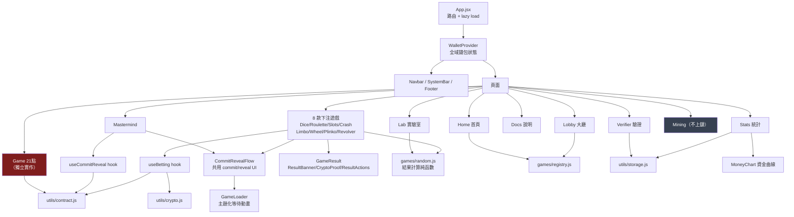
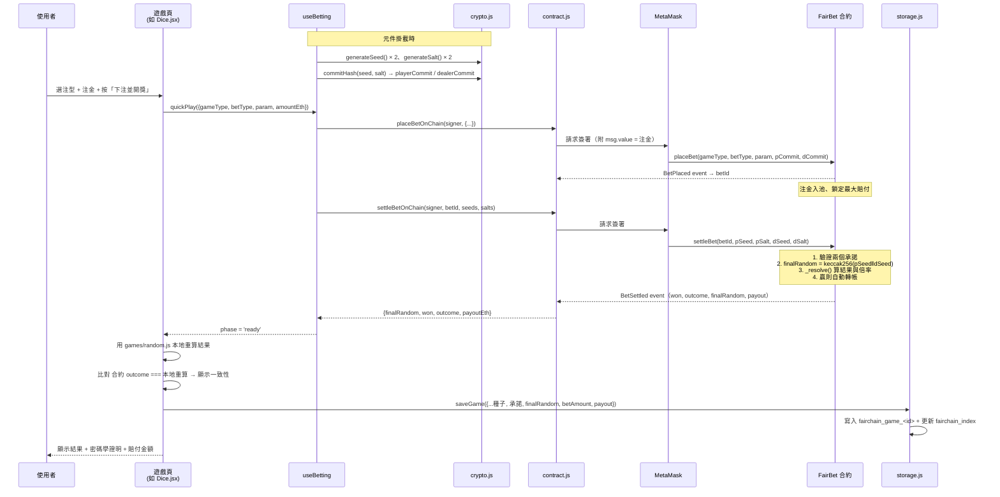
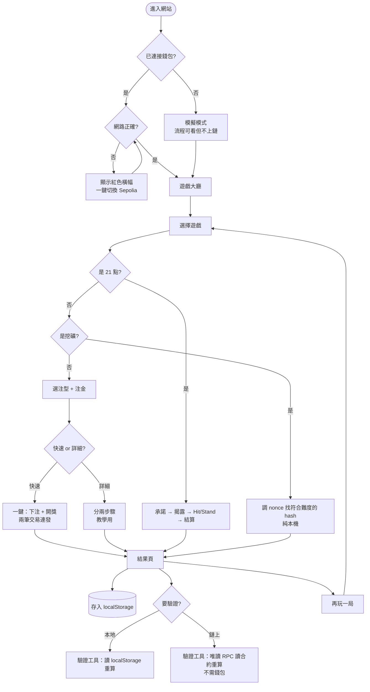

# 系統架構與資料流

## 一、整體架構

**沒有傳統後端、沒有資料庫伺服器。** 這是刻意的架構決策：
權威資料放在**區塊鏈**（不可竄改、公開），本機只放**快取與偏好**（localStorage）。



### 各節點用途

| 節點 | 檔案 | 用途 |
|---|---|---|
| 表現層 | `src/pages/`、`src/components/` | 畫面渲染、使用者互動 |
| 應用邏輯層 | `src/hooks/`、`src/games/` | 遊戲流程狀態機、結果計算、遊戲註冊 |
| 密碼學層 | `src/utils/crypto.js` | 種子／salt 生成、承諾計算、承諾驗證 |
| 錢包層 | `src/context/WalletContext.jsx` | MetaMask 連線、網路切換、取得 signer |
| 合約互動 | `src/utils/contract.js` | 封裝所有鏈上讀寫，含唯讀 provider |
| 本地儲存 | `src/utils/storage.js` | 遊戲紀錄索引、UI 偏好、統計聚合 |
| FairBet 合約 | `contracts/contracts/FairBet.sol` | 9 種下注遊戲的收注／判定／賠付／資金池 |
| GameCommitReveal | `contracts/contracts/GameCommitReveal.sol` | 純 Commit-Reveal 驗證（21 點、Mastermind 用） |

---

## 二、元件關係圖



> 🔴 紅色 `Game.jsx`（21 點）**自行實作 commit/reveal 流程，未使用共用 hook**——這是已知技術債，見 [TECH_DEBT.md](./TECH_DEBT.md)。
> ⬜ 灰色 `Mining.jsx` **完全不接觸合約**，是純本機 PoW 教學。

---

## 三、資料流程圖（以「鏈上下注」為例）



### 關鍵設計：為什麼前端要「本地重算」再比對？

合約已經算出結果了，前端仍用 `games/random.js` 重算一次並比對，
是為了**當場證明「前端演算法 ≡ 合約演算法」**。若兩者不一致會顯示 🚨 警告。
這是「逐位元一致」主張的即時證據。

---

## 四、使用者操作流程圖



---

## 五、資料流追蹤（依功能）

### A. 種子與承諾（所有 Commit-Reveal 遊戲）

```
useBetting 掛載
  → crypto.generateSeed()      產生 32-byte 隨機種子（ethers.randomBytes，CSPRNG）
  → crypto.generateSalt()      產生 32-byte 隨機 salt
  → crypto.commitHash(s, salt) = ethers.solidityPackedKeccak256(['bytes32','bytes32'],[s,salt])
  → 存於 useState（惰性初始化，全程不重新產生 ← 若中途改變承諾會對不上）
  → placeBet 時只送 commit 上鏈（種子仍保密）
  → settleBet 時才送出明文 seed + salt
  → 合約 keccak256(abi.encodePacked(seed, salt)) 比對
```

### B. 結果計算（下注遊戲）

```
合約 settleBet
  → finalRandom = keccak256(abi.encodePacked(playerSeed, dealerSeed))
  → _resolve(gameType, betType, param, amount, finalRandom)
      Dice     : uint32(bytes4(fr)) % 6 + 1
      Roulette : uint32(bytes4(fr)) % 37
      Slots    : 三段 bytes4 各 % 6
      Crash/Limbo: crashBps(fr) = min(1e6, 10000·2^52/(2^52 − fr mod 2^52))
      Wheel    : uint256(fr) % 8 → 倍率表
      Plinko   : popcount(uint256(fr) & 0xFFFF) → 17 槽倍率表
      Revolver : uint256(fr) % 6，存活條件 chamber >= 子彈數
  → payout = amount × multiplierBps / 10000
  → emit BetSettled

前端同時用 games/random.js 以完全相同公式重算 → 比對一致性
```

### C. 儲存與統計

```
遊戲結束 → storage.saveGame(record)
  ├─ 完整紀錄 → localStorage['fairchain_game_<gameId>']
  └─ 摘要索引 → localStorage['fairchain_index']（最多 50 筆，新的在前）
                 { gameId, gameType, ts, result, onChain, bet, net }

Stats 頁 → storage.getStats()  聚合索引 → 勝率／鏈上局數／總下注／總淨收益
        → MoneyChart           反轉索引成時間序 → 累積淨收益折線圖
Lobby 頁 → storage.recentGames() → 最近 8 局表格
Verifier → storage.loadGame(id)  → 完整紀錄重算驗證
```

### D. 鏈上驗證（第三方，不需錢包）

```
使用者輸入鏈上 Game ID
  → contract.getReadOnlyProvider()      new ethers.JsonRpcProvider(公開 RPC)
  → contract.getGameData(provider, id)  呼叫 GameCommitReveal.getGame()
  → 取回 player/commit/seed/salt/finalRandom/state
  → 前端用 crypto.verifyCommit() 與 combineSeeds() 重算比對
  → 用 gameLogic.dealCards(finalRandom) 重算牌面顯示
```

> ✅ **已補齊（2026-09-08）**：Verifier 現有三種模式——
> 「本地紀錄」「鏈上・公平局」（GameCommitReveal）與「**鏈上・下注局**」（FairBet）。
> 下注局驗證流程：`getBetData()` 讀 `getBet()` 取得承諾與 finalRandom，
> 再以 `BetSettled` 事件定位結算交易、解碼 calldata 取回種子，
> 完成「承諾驗證 + finalRandom 驗證 + outcome 重算比對」三項；
> 若 RPC 限制日誌查詢，則降級為「outcome 一致性」驗證並明確告知。
